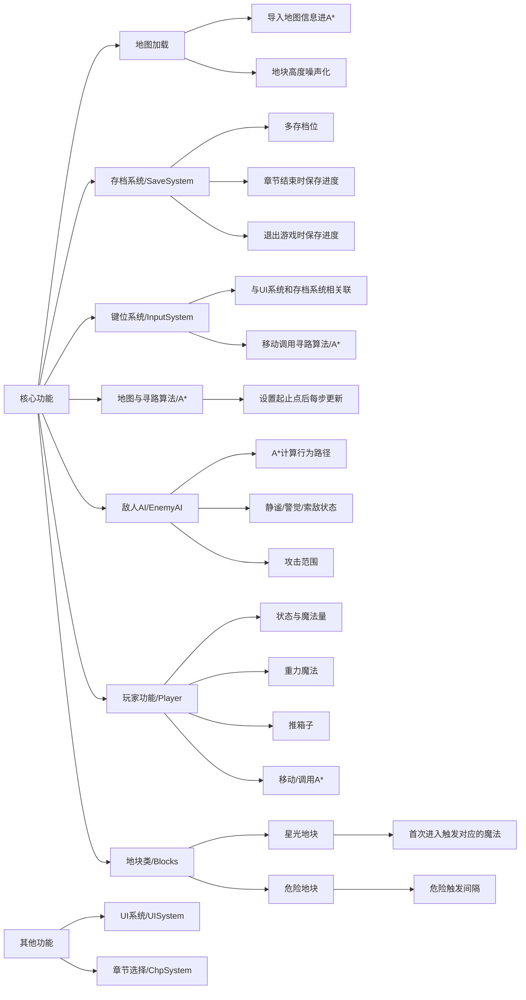

# 寻星之路(Star Way)策划案

寻星之路是一个3D解谜游戏。
# 故事背景
因为在学院犯错而被家族惩罚，在禁锢法阵中昏睡了数年的Orion·Star-Lord在法阵魔力散尽的那一刻苏醒了，但迎接他的却是空无一人的大厅。家族成员神秘失踪，留下残破的星图，Orion决定找到遗失在各个迷宫里的星光，唤醒支离破碎的族人们。
在找到一个星座遗失的星光之后，Orion会了解到这个星域的人们究竟遭遇了什么事件，才被击败的七零八碎。揭开被时间掩埋的真相，救赎法师们吧！
由**波函数坍缩算法**生成的选择界面

# 玩法设计
## 角色
### 玩家

作为星之法师，Orion拥有以下能力：
- （技能）**重力控制**
可以在没有地块的地方造出地块、升起地块形成障碍物、下降障碍物形成可行走地块。
在移动地块时发出的震动和声音会吸引附近地块的敌对生物被吸引，脱离岗位前来观察。
- （被动）**星语者**
与天上的星星对话，通过星星的视角来观察地形，获得地图的**鸟瞰视角**。
但该被动在洞穴或者其他见不到星星的场景无法使用。
- （被动）**夜视能力**
可以在黑暗中捕捉到微弱的光并放大到能清晰看见的程度。夜视情况下图像的渲染风格偏向于赛博电子风。
- （存档）**星域领主**
在取得星光（白/黄/红/蓝）时，Orion可以回满能量条使用一些高阶的星之魔法，例如：
  - 陨星术（黄色星星）
  允许Orion修复断桥（用陨石砸向断桥位置填补空缺)，让Orion能登上高处的地图
  - 恩泽（红色星星）
  待定
  - 恒星的重力与温度（蓝色星星）
  让一个地图格子消失、四个地图格子塌陷并成为危险无法行走的地块，在该范围内的敌对生物将失去行动能力。地图可以设计成敌对生物比较多看似无解的画面，然后玩家利用蓝色星星清除部分怪

获取星星的同时，地图会发生一些改变，例如地形升降、空降新敌人、出现新的危险地形等等。

### 敌对生物

根据关卡的不同，敌对生物也将以不同的形态出现，如：蠕虫/鳗鱼、章鱼、眼球、时之法师（没错，但不是我）...
#### 特点
- 敌对生物在发现Orion前在指定路线上巡逻，有特殊的颜色表示敌人是否警觉。
- 敌对生物发现Orion后将依照寻路算法来攻击Orion。但当Orion躲避进掩体或当敌对生物到刚刚看到Orion的地方转一圈没看到Orion之后就会回到他的岗位继续巡逻。
- 敌对生物的移动速度是Orion的1.5倍，因此和敌对生物进行追逐战是不太可行的。
- 一些敌对生物（例如章鱼）在未接触到Orion时就能对其发动攻击。

当Orion被敌对生物攻击时，关卡复位到上一个存档点。

## 关卡
包含了多种元素的地图，由**可移动**、**不可移动**、**危险**、**隐匿**四种地块组成。星光随机散落在地图的角落，Orion需要在不受到攻击的情况下收集所有星光。
地图除了平面设计之外也可以是阶梯式的、升高的
### 地块
- 可移动地块
允许角色在上面行走的地形，如矮草地、平地等
- 不可移动地块
不允许角色在上面行走的地形，如水面、岩浆、沼泽、虚空等
- 危险地块
这种地块间隔一小段恒定的时间后就会孕育出危机，例如冒泡的洼地可能窜出毒蛇、施术过的固态时间可能让Orion变成婴儿。在危险地块变得危险时，Orion接触到地块就会死亡
- 隐匿地块
可以通行，但Orion在上面走的时候不会被敌对生物发现的地块，例如高草丛、藤曼丛、帷幕等

### 可交互物体
- 箱子
Orion可以推着走，用来应对危险地块。在危险地块上对其施展重力魔法可以使箱子下陷成为可行走的安全地块。下陷时会吸引敌对生物，注意隐蔽
- 星光
关卡最重要的收集品，关卡应该被设计成缺少任意一个星光都无法顺利通过

# 关卡设计
## 第一章节/沼泽
背景：沼泽
背景音乐：Music generated by Mubert https://mubert.com/render
这一章节的主要目的在于教学，分为三个小节（1-1/1-2/1-3）

## 第二关/深海

## 第三关/黑暗深渊

## 第四关/时间

## 第五关/

# 参考
## 玩法参考
参考1：Timelie
点击式移动 + 敌对生物
重力吸引敌对生物注意力的想法参考了猫猫

参考2：纪念碑谷
舞台扭转式过场参考了错视觉变换的部分

## 美术参考

风格化渲染，整体风格为渐变+描边+强对比+荧光。面数像这样就可以了:

参考2，拉高对比度，把浅绿色的部分用荧光代替：

参考3：渐变可以用笔刷涂的形式，更有颗粒感，或者纯色渐变（小鸭子泡水），哪种更为合适？

参考4：由于整体画风问题，关卡内的角色为二头身，如下图：

# 核心功能

## 默认键位
<kbd> ESC </kbd> 打开设置并暂停游戏
<kbd> SPACE </kbd> 暂停游戏
<kbd> W </kbd> 基本交互，如吸收星光、抓住箱子
<kbd> E </kbd> 施展重力魔法
<kbd> mouse </kbd> 选择施术地块/选择移动目的地
<kbd> right click </kbd> 确认选择

> 如果有时间
加上用户自定义按键更好。另外暂停时背景音乐发生对应变化（参考蔚蓝，我喜欢这个设计

## 游戏流程
### 章节选择
这部分可以直接拿翻转剧场的轮子
不同的是我打算用Wave Function Collapse生成选择界面的图像

### 关卡加载
完全规整的章节模型将被存储在prefab里。在进入对应关卡时，模型将被加载在场景根节点下，同时玩家被放置在出生点的位置
模型初载时我希望能做出高台从天而降，地面从低上升，最后组成关卡的效果，然后玩家通过一种动画出现在指定位置

### 自动存档
在每个章节完成时进行自动存档，和其他所有游戏的自动存档功能是一样的
这部分主要记录的是关卡解锁到哪里了，理论上只需要一个量就好了，直接用playerfab是比较好的一个选择

## 游戏性
### 玩家
#### 状态
能量值：显示在屏幕上方的横线
可见性（隐匿地块、被高台/箱子挡住时）：不可见时即使在敌对生物攻击范围内也不会失败
收集数：决定了大门能否被开启

#### 重力魔法
仅对标注了ground标签的地块生效，鼠标指示地块时地块边缘显示描边效果，点击时对选定地块的高度进行改变。
地块本身的高度受到随机数影响，并不是完全一致的。但初始环境下，高台高度（$y$）为0，地面高度为-1。所以可以简单通过下列方法进行判断：
> 高台：高度 $\geq$ 0
地面：高度 ＜ 0

在进行重力控制时，检测到高台则用迭代器的写法将高台的高度移到 $-1 +$ 随机数 $r$
同理，在检测到地面时用相同方法移动到 $0 +$ 随机数 $r$

### 地块
要写的就危险地块，因为不同章节的危险地块有所不同。
间隔：间隔多久出一次危险物质
持续性：是否持续
开关：关停危险地块
待补充，反正第一节没有（你怎么回事

## 敌人AI
敌对生物不会在地图上直观地显示它的攻击范围。多死几次就知道了
- 静谧状态
敌对生物按照设定好的道路行走（输入起止点就好了，此处可以直接用A*的轮子）。敌对生物不会走进高草丛
- 警觉状态
注意看，这个星之法师叫Orion，他在地图上闹出了超大的动静。在重力魔法作用的一定范围内如果检测到敌对生物，将它的寻路终点改成Orion的施术位置
- 索敌状态
除非玩家用重力魔法制造出封闭区域，否则敌对生物会追杀玩家直到击杀

# 代码结构

好吧举个例子，现在一个玩家打开了游戏：
1. 进入初始界面，选择读取存档或新建游戏（**存档系统** 和 **UI系统**）
2. 选择读取存档后进入选择章节界面，随便选一个关卡（**章节选择**）
3. 进入关卡（**地图加载** 和 **敌人AI** 初始化）
4. 鼠标选择玩家的移动目标（**键位系统** 和 **地图与寻路算法**）
5. 对高台使用魔法，把敌对生物给吸引过来了（**玩家功能** 和 **敌人AI**）
6. 得到第一个星光，同时获得一次高阶魔法施法机会（**地块类/星光地块** 和 **敌人AI**）
7. 利用箱子阻挡敌对生物躲避追踪（**玩家功能** 和 **敌人AI**）
8. 到达出口，关卡完成（**存档系统**）

